  

### AI/ML engineer

Mostly computer vision, reinforcement learning and LLM tooling. I like problems
where the model has to work on cheap hardware, in bad light, with no second chances.

- **[poaching-detection](https://github.com/chanchreekjain/poaching-detection-system)** — a Pi in a forest, watching for weapons
- **[jobtrail](https://github.com/chanchreekjain/jobtrail)** — paste a JD, get told the truth
- **[portfolio](https://github.com/chanchreekjain/portfolio)** — the pretty one

         

 

  <picture>
    <source media="(prefers-color-scheme: dark)" srcset="https://raw.githubusercontent.com/chanchreekjain/chanchreekjain/output/github-snake-dark.svg">
    <source media="(prefers-color-scheme: light)" srcset="https://raw.githubusercontent.com/chanchreekjain/chanchreekjain/output/github-snake.svg">
    
  </picture>

